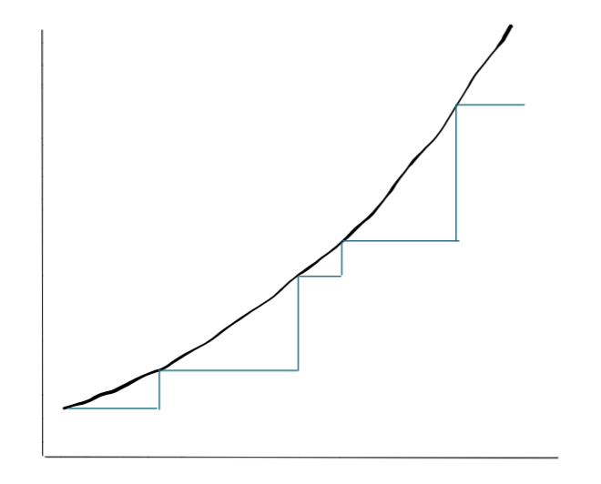

# Submission to artemis-academy/prework

## Objective

Write a staking contract that allows for timelocked staking and variable reward rates. Ability to offer junior and senior reward rates, one after the other. 

## Rationale

- As part of my work at Maker one of the challenges we have identified to future growth is how to transform the liabilities of the DAI on the balance sheet
- A simple way banks do it is by offering CDs that lock tokens for a time period and provide a preferred interest rate

## Proposed Solution

- Two ERC20 tokens involved: `Steaks` and `SteakReceipts`
- Staking contract `Staking` that mediates the interaction between depositors and staking rewards
- A time-locked staking contract that can be combined with other deployments that have different time-locks and whose reward balances update in cascade
- Rates should accrue and the reward balances updated every time there is a contract interaction of any kind
- I would have liked to have built in a Senior/Junior tranche into this contract but was unable
- e.g. would have loved to have been able to build out: If there are two deposits A and B, senior and junior respectively, then no more contract interactions until all the rewards run out, the Senior tranche should receive the lower of total rewards available vs accrued rewards. The junior tranche should receive the lower of what’s left after the Senior gets paid vs accrued rewards

## Steaks.sol

- Drawing from the OpenZeppelin standards, trying to rewrite it in a minimal and likely unsafe way
- Added two events to the token contract for Staking and Unstaking
- No constructor function - the tokens are initialized on deployment. I’m not sure if this means the total supply is now locked inside the token contract itself. An alternative could have been to include an onlyOwner modifier on the mint function and start it at 0. Being at Maker I have been exhaustively drilled in the importance of decentralization and keeping shortcuts like this away from DeFi
- I originally had a transferrability boolean attribute to enforce whether the token could move or not with require() but I realized that all the function did was lock and unlock all of the tokens so I removed it:

```solidity
function transferrable() external returns (bool) {
        _transferrable = !_transferrable;
        return _transferrable;
    }
```

- Also realizing this sort of function should only every be `private pure`.

## Staking

- Drawing from Solidity by Example
- Min and max are amazingly not implemented in the spec so they have to be included. Ternary operators are supported though. Private function i.e. cannot be called outside of the contract and pure i.e. doesn’t change read or write the state of the block
- Problems to solve:
    - User addresses should be able to stake into a lock
    - Rewards have to accrue in the background
    - There needs to be a source of rewards to distribute
- I start by implementing one staking contract before trying to implement a senior/junior rule

## Algorithm

Each interaction with the contract triggers an event so staking rewards are awarded in a discontinuous manner by allocating rewards per token to the calling account and updating the rewardsPerToken for each account accordingly

- Start the clock with the first `stake` call
- Transfer `stakingTokens` from the user to the contract
- Send `receiptTokens` from the contract to the user
- Add the `amount` to the `msg.sender` balance and increase the `totalSupply`
- Record the `time`
- Wait for the next event



> Discontinuous approximation of continuous compounding triggered on each event

Next event:

- Update the rewards per token staked by calculating:
    - `rewardsPerToken + rate * (block.timestamp - lastUpdated) * 1e18 / totalSupply`
    - Update the time `lastUpdated = block.timestamp`
    - Update the rewards saved for the `msg.sender` through 
    `rewards[msg.sender] += balanceStaked[msg.sender] * ((rewardsPerToken * rate * (block.timestamp - last) * 1e18)/totalSupply - userRPT[msg.sender]) / 1e18`  
    If `last = block.timestamp`=> `**rewards[msg.sender] += balanceStaked[msg.sender] * userRPT[msg.sender] / 1e18**`
    - Update the `userRPT[msg.sender]` by equating it to the global rewards per token in that time period
- Rate per second is set by the contract owner as an annualized rate decomposed by `n^(1/365)` offline
- Rewards are limited by the availability of supply, i.e. `min(calculation from formula, available balance)`

## Personal Observations

- This is the very first time I have tried to write any sort of smart contract code (and the first time in a long time I have written any sort of code at all). I started with reimplementing ERC20 contracts. I know these are solved problems but I find the best way for understanding things is to go through them yourself. My implementation is likely flawed

## Missing Requirements
- [X] Carefully comment your code.
- [ ] Write some unit tests for your code where it makes sense.
- [ ] Deploy your contracts to Goerli testnet.
- [ ] Save the addresses of the deployed contracts of your final solution.
- [X] Publish your solution in a secret GitHub Gist.
- [X] Be mindful of which GitHub account you use to create your Gist if you'd like to remain anonymous.
- [X] Share the link to the GitHub Repository with your solution, the addresses of the deployed contracts and your essay.
- [X] Feel free to use resources at your disposal such as Google, Solidity documentation, and/or any online learning tools.
- [X] We recommend using RemixIDE to develop your solution. [http://remix.ethereum.org](http://remix.ethereum.org/).

## Objectives from bootcamp
- [ ] Upskill software development 
- [ ] Learn code patterns to develop original smart contract ideas with minimal supervision
- [ ] Learn engineering practices to leverage common development tools and be able to contribute

## Criteria for success:
- [ ] Be in a position to add a meaningful contribution to a large open source smart contract project
- [ ] Deploy an original contract idea on mainnet